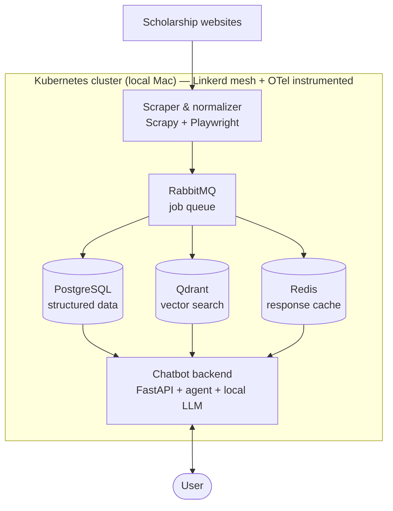
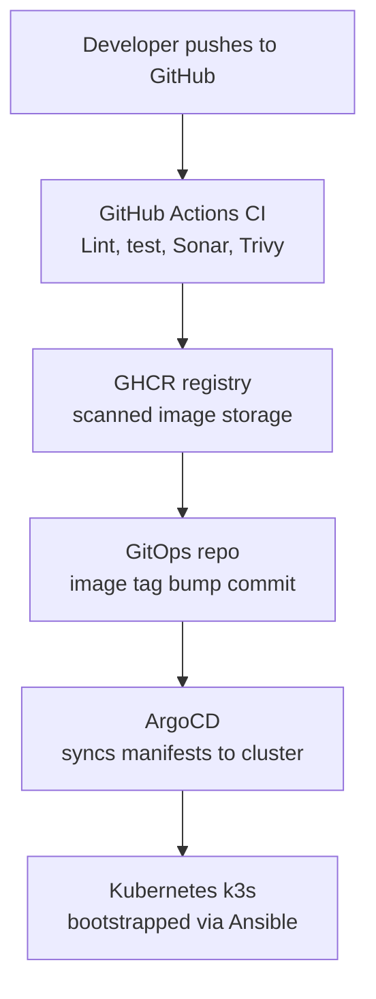

# Scholarship chatbot

An AI chatbot that scrapes ongoing and upcoming scholarship opportunities from the web,
stores them in a queryable data layer, and answers user questions through a RAG-backed
agent — all built on open-source, self-hostable infrastructure and deployable on a local
Kubernetes cluster.

Full design rationale lives in [`docs/architecture.md`](docs/architecture.md). This README
covers the quick facts: what's in the box, how the pieces connect, and how to get something
running locally.

## Architecture at a glance

### Data & query pipeline



Scholarship data flows in from source websites, gets normalized and deduplicated, and lands
in three stores that the chatbot's agent chooses between at query time: Postgres for
structured filters ("closing in 7 days"), Qdrant for semantic search ("AI research grants in
Europe"), and Redis to cache repeated answers. The LLM (Ollama, running locally) generates the
final response from whatever context the agent retrieves.

### CI/CD pipeline



Every push is linted, tested, scanned for code quality (SonarQube) and image vulnerabilities
(Trivy), then built and pushed to GHCR. A GitOps repo commit bumps the image tag, and ArgoCD
picks up the change and syncs it into the cluster — no manual `kubectl apply`.

Availability checks (CronJob hitting `/healthz` + a sample chat query) and load tests
(k6/Locust) run as jobs against the deployed cluster. Prometheus/Grafana and
OpenSearch/Kibana collect metrics, traces (via OpenTelemetry) and logs from every service in
both diagrams above.

## Tech stack

| Layer | Tool |
|---|---|
| Scraping | Scrapy, Playwright |
| Queue | RabbitMQ |
| Structured data | PostgreSQL |
| Vector store | Qdrant |
| Cache | Redis |
| Backend | FastAPI, LangGraph/LlamaIndex agent |
| LLM | Ollama (Llama 3.1 / Mistral, local) |
| CI | GitHub Actions |
| Code quality | SonarQube Community / SonarCloud |
| Image scanning | Trivy |
| CD | ArgoCD (GitOps) |
| Cluster bootstrap | Ansible |
| Orchestration | k3s / Kind |
| Service mesh | Linkerd |
| Observability | OpenTelemetry, Prometheus, Grafana, OpenSearch, Jaeger |
| Load/availability testing | k6, Locust, CronJob health checks |

All components are open source and free to self-host. See `docs/architecture.md` for the
full reasoning behind each choice, including Mac resource notes.

## Quick start (local, no Kubernetes yet)

The recommended path is to validate the chatbot logic with `docker-compose` before touching
Kubernetes — see the phased roadmap below.

```bash
cp .env.example .env         # fill in local config
docker compose up -d         # postgres, redis, rabbitmq, qdrant, ollama
# then run the scraper and backend locally against those services
```

(`docker-compose.yml` and `.env.example` are scaffolded — fill in service definitions as you
build each component. See `CLAUDE.md` for build order.)

## Repository structure

```
scholarship-chatbot/
├── scraper/            # Scrapy/Playwright spiders, normalizer, embedder workers
├── backend/             # FastAPI app, agent orchestrator, tool definitions
├── shared/              # Pydantic schemas shared by scraper + backend
├── tests/                # unit + integration tests
├── data/                # markdown corpus snapshot (git-tracked scholarship records)
├── .github/workflows/  # CI pipelines (lint, test, sonar, build, trivy, push)
├── gitops/              # K8s manifests ArgoCD watches (app-of-apps pattern)
├── ansible/             # cluster bootstrap playbooks (k3s, ArgoCD, Linkerd)
├── docs/                # full architecture doc + decision notes
├── docker-compose.yml   # local dev stack (pre-Kubernetes)
├── sonar-project.properties
└── CLAUDE.md            # instructions for Claude Code when working in this repo
```

## Roadmap (1 year, phased)

| Phase | Months | Focus |
|---|---|---|
| 1 | 1–2 | Scraper MVP + Postgres + Markdown corpus (no K8s) |
| 2 | 2–3 | FastAPI backend + Ollama + RAG via docker-compose |
| 3 | 3–4 | GitHub Actions CI: lint, test, Sonar, Trivy, build, push |
| 4 | 4–5 | k3s/Kind cluster via Ansible; manual `kubectl` deploy first |
| 5 | 5–6 | ArgoCD GitOps migration (app-of-apps) |
| 6 | 6–7 | RabbitMQ pipeline decoupling + Redis caching |
| 7 | 7–8 | Observability: OTel + Prometheus/Grafana, then OpenSearch/Kibana |
| 8 | 8–9 | Linkerd service mesh + NetworkPolicies |
| 9 | 9–10 | Availability CronJob + k6/Locust load testing |
| 10 | 10–12 | Hardening: secrets management, chaos testing, docs, agent quality |

## License

Choose and add a license (e.g. MIT/Apache-2.0) before publishing.
